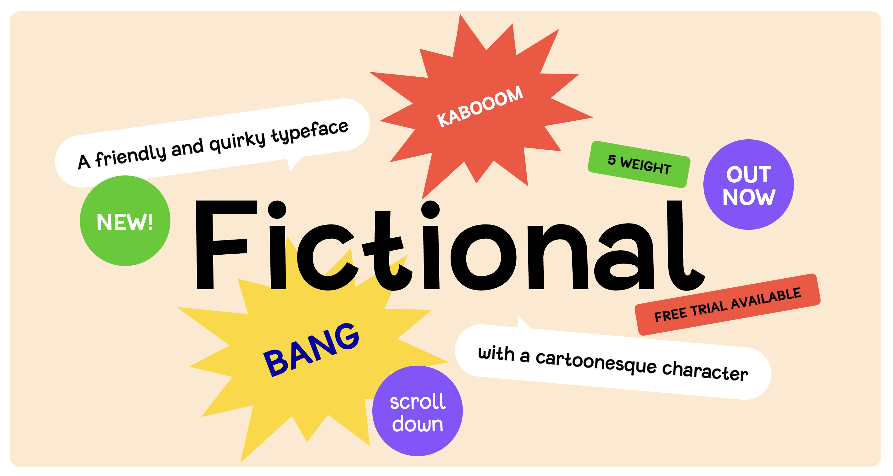

# fictional-typeface

This project is a website that allows users to explore a fictional typeface and interact with it in various modes.

## Features

1. **Select Mode:** Users can explore the various font sizes and appearance options available in the fictional typeface. This mode allows users to select different settings and see how the typeface looks in real-time.

2. **Text Mode:** In this mode, users can directly edit and use the fictional typeface for their own text. They can input their desired text and see it rendered in the chosen font style.

3. **Fire Mode:** This mode adds a fun element to the website by incorporating a shooting game. Users can shoot the text elements displayed on the screen, providing an interactive and engaging experience.

4. **Animations and Sound Effects:** The user experience is enhanced through the incorporation of animations and sound effects. These visual and auditory elements create a more immersive environment for font exploration.

## Live Site

You can access the live site [here](https://fictional-typeface-clone-by-lilianlee.netlify.app).

## Reference

The website was constructed using HTML, CSS, and JavaScript, taking inspiration from an existing [Fictional Typeface](https://fictional-typeface.com/) website.
